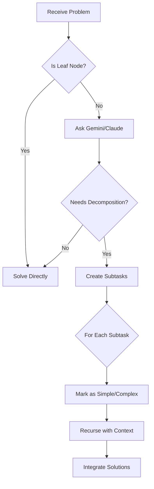

# System Architecture

## Overview

The Agent Tree system implements hierarchical problem decomposition using a tree of Claude agents.

## Core Architecture

### 1. Context Management (`src/context.py`)
- **Purpose**: Propagate information down the tree
- **Contents**: Root goal, parent task, sibling tasks
- **Flow**: Parent → Children (unidirectional)

### 2. Agent Nodes (`src/agent_node.py`)
- **Decomposition**: Analyzes if problem needs breaking down
- **Solving**: Handles leaf nodes and simple problems
- **Integration**: Combines child solutions

### 3. Tree Orchestration (`src/agent_tree.py`)
- **Recursion Control**: Depth and node limits
- **Workspace Management**: Organized output structure
- **Solution Flow**: Bottom-up integration

## Decomposition Decision Flow



## Node Types

### 1. Root Node
- Entry point for problem
- No parent context
- Creates initial decomposition

### 2. Branch Nodes
- Can decompose further (`is_leaf=False`)
- Pass context to children
- Integrate child solutions

### 3. Leaf Nodes
- Cannot decompose (`is_leaf=True`)
- Solve directly
- Return solution to parent

## Communication Flow

### 1. Downward (Context)
```
Root Problem
    ↓
Parent Task + Approach
    ↓
Sibling Awareness
```

### 2. Upward (Solutions)
```
Leaf Solutions
    ↑
Integrated Solutions
    ↑
Final Solution
```

## External Integrations

### Claude CLI
- Primary LLM for solving
- Integration tasks
- Fallback for decomposition

### Gemini (via MCP)
- Fast decomposition decisions
- JSON-structured responses
- Optional optimization

## Limits & Constraints

1. **Depth Limit**: Max 3 levels (configurable)
2. **Node Limit**: Max 5 nodes per tree
3. **Timeout**: 2 minutes per Claude call
4. **Context Size**: Full ancestor chain

## Error Handling

1. **Graceful Degradation**
   - MCP fails → Claude CLI fallback
   - JSON parse fails → Solve directly

2. **Resource Protection**
   - Node count tracking
   - Depth limit enforcement
   - Process termination on timeout

## Output Structure

Each execution creates:
```
workspace/
└── agent_tree_TIMESTAMP/
    ├── problem.txt         # Original input
    ├── final_solution.txt  # Integrated result
    └── root/
        ├── solution.txt    # Root's work
        └── sub1/
            └── solution.txt
```