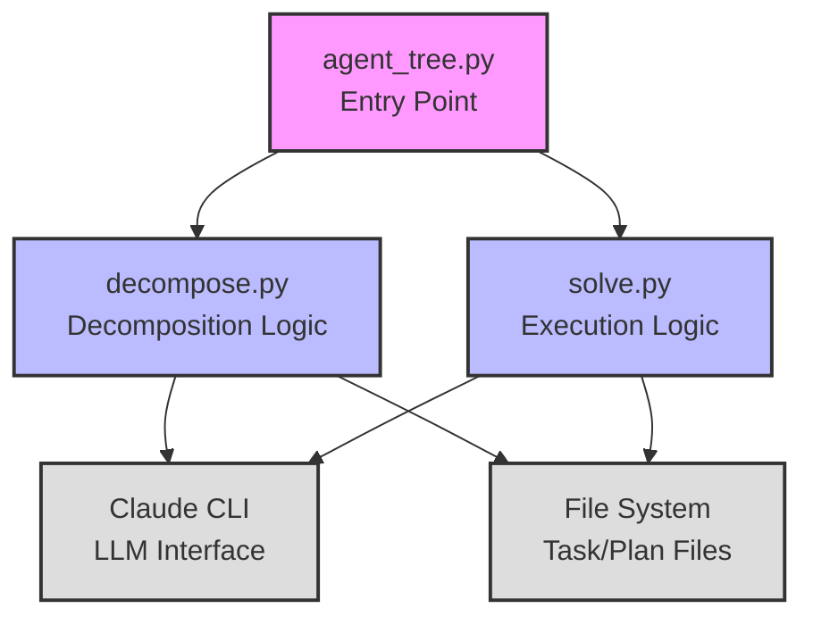
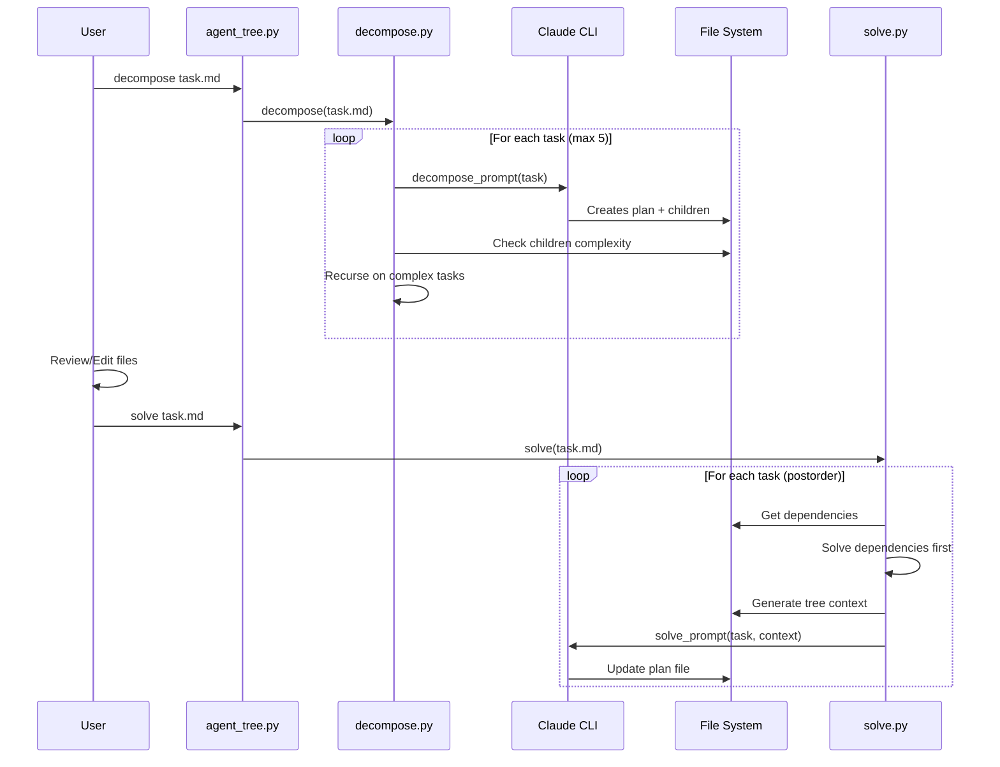

# Agent Tree Simplification Plan

## Overview
Transform the current monolithic agent-tree system into a cleaner two-phase architecture with separate `decompose` and `solve` commands.

## Key Design Decisions

1. **Node Limit**: Keep 5-node limit during decomposition (max 5 Claude calls)
2. **Dependencies**: Use markdown `### Dependents` section with file links
3. **Input**: User provides initial task as .md file (not string)
4. **Folder Structure** (No file moving!): 
   - Task files: `{task_name}.md` - describe the problem/goal
   - Plan files: `{task_name}_plan.md` - decomposition analysis, progress tracking, and final summary
   - Children folder: `{task_name}_children/` - contains subtask files
   - NO separate solution files - progress tracked in plan files

## Target Pseudocode

This is the simple, intuitive flow we're aiming for. **Any deviation from this pseudocode should be intentional and justified**:

### main.py
```python
# Phase 1: python agent_tree.py decompose task_file.md
# Phase 2: Human can modify files
# Phase 3: python agent_tree.py solve task_file.md
```

### decompose.py
```python
# Global state for tracking
node_count = 0
seen_tasks = set()

def decompose(task_file):
    global node_count, seen_tasks
    
    if node_count >= 5:
        return  # Hit 5-node limit
    
    task_name = extract_name(task_file)
    children_dir = f"{task_name}_children"
    
    node_count += 1
    # Agent creates: plan file + children tasks in children_dir
    # Each child .md specifies if it's simple or complex
    agent(decompose_prompt(task_file))
    seen_tasks.add(task_file)
    
    for each .md file in children_dir not in seen_tasks:
        seen_tasks.add(file)
        if is_complex(file):  # Claude already marked it as 'complex'
            decompose(file)  # No file moving needed!
```

### solve.py
```python
# Tree search, postorder traversal (leaves first)
solve(task):
    if has_child_or_dependency:
        dependent = get_dependent(task)  # Look for links in ### Dependents
        solve(dependent)
    
    # Generate tree with one-line summaries
    tree_context = generate_tree_with_summaries(workspace_root)
    agent(solve_prompt(task, tree_context))
    # Agent updates plan file with progress and results

# Future: detect_circular_dependencies() - warn user during feedback period
```

## System Architecture

### Module Structure


### Flow Diagram


## Decomposition Flow

1. **Initial Call**: Start with user-provided `task.md` file
2. **Claude Creates**:
   - `task_plan.md` - Analysis and links to children
   - `task_children/` folder with subtask .md files (each marked simple/complex)
3. **For Each Child**: Check if Claude marked it as complex
4. **If Complex**: Recurse on that file (no moving!)
5. **Track Seen**: Avoid reprocessing tasks

## Core Tasks

### 1. Extract and Refactor Decomposition Logic ✅
- [x] Create new `decompose.py` module
- [x] Extract decomposition logic from `src/agent_tree.py`
- [x] Implement new folder/file structure:
  - Task files: `{name}.md`
  - Plan files: `{name}_plan.md` 
  - Children: `{name}_children/` folder
- [x] Create `decompose_prompt` that:
  - Creates a plan file with analysis and child links
  - Creates children tasks in `_children/` folder
  - Marks each child as simple or complex
  - Includes `### Dependents` section where needed
- [x] Keep 5-node limit using global counter
- [x] Implement complexity detection from markdown
- [x] Add recursive decomposition without file moving

### 2. Create Independent Solve Module ✅
- [x] Create new `solve.py` module
- [x] Implement postorder traversal to solve leaves first
- [x] Implement `get_dependents()`:
  - Parse `### Dependents` section from task files
  - Extract markdown links to other .md files
  - Return list of dependent file paths
- [x] Implement `generate_tree_with_summaries()`:
  - Build tree structure of all task files
  - Extract one-line summary from each task
  - Mark current task with [YOU ARE HERE]
- [x] Create `solve_prompt` that:
  - Includes tree context
  - Explains agent can read other files if needed
  - Contains coding best practices
- [x] Update plan files with progress and results (no separate solution files)
- [x] Handle solution integration for parent tasks
- [x] Add progress tracking (mark as seen/processed)

### 3. Update Main Entry Point ✅
- [x] Modify `agent_tree.py` to support two subcommands
- [x] `python agent_tree.py decompose task_file.md`
- [x] `python agent_tree.py solve task_file.md`
- [x] Add --help for each subcommand
- [ ] Update documentation and examples

### 4. Enhance Robustness and Features (Post-MVP)
- [ ] Add circular dependency detection (warn user during solve phase)
- [ ] Add basic error handling only after core system is stable
- [ ] Create utility to visualize task tree
- [ ] Add optional context preservation (simplified version)
- [ ] Implement solution validation
- [ ] Add resume capability for interrupted solves

Note: These are post-MVP features. During development, let errors crash with clear stack traces.

## Implementation Progress

1. **Step 1**: ✅ Refactored `agent_tree.py` with subcommands
2. **Step 2**: ✅ Created `decompose.py` module  
3. **Step 3**: ✅ Created `solve.py` module
4. **Step 4**: 🔄 **NEXT: Integration testing and cleanup**

### Current Status (June 28, 2025)
- [x] All three core modules implemented by parallel agents
- [x] Entry point supports decompose/solve subcommands
- [x] Decompose module with recursive logic and Claude integration
- [x] Solve module with dependency resolution and tree context
- [x] Integration tests created (need minor fixes)
- [x] Test suite reorganized into tests/ directory
- [x] Documentation updated (README, workflow guide)
- [ ] Fix remaining test failures
- [ ] Clean up temporary files
- [ ] Remove old src/ code
- [ ] Final testing of full workflow

### Next Steps
1. Fix interface mismatches in tests
2. Run full test suite to verify
3. Test with real example end-to-end
4. Clean up development artifacts
5. Consider moving to src/ if desired

## Example Usage

```bash
# Phase 1: Decompose
python agent_tree.py decompose web_scraper.md
# Claude creates: web_scraper_plan.md + web_scraper_children/ folder
# Recursively decomposes complex children

# Phase 2: Human Review (edit markdown files as needed)
# Can modify task descriptions, dependencies, add/remove tasks

# Phase 3: Solve
python agent_tree.py solve web_scraper.md
# Processes dependencies first, then solves bottom-up
# Updates plan files with progress and results
```

## Example Folder Structure

```
tasks/
├── web_scraper.md                    # Root task (complex)
├── web_scraper_plan.md               # Analysis, progress, and results
└── web_scraper_children/
    ├── fetch_urls.md                 # Simple subtask
    ├── fetch_urls_plan.md            # Progress and results
    ├── parse_html.md                 # Simple subtask
    ├── parse_html_plan.md            # Progress and results
    ├── extract_data.md               # Complex subtask
    ├── extract_data_plan.md          # Analysis, progress, and results
    └── extract_data_children/
        ├── find_selectors.md
        ├── find_selectors_plan.md
        ├── handle_pagination.md
        └── handle_pagination_plan.md
```

## Dependency Example

```markdown
# Extract Articles
## Type
complex
## Summary
Extract article data from parsed HTML
### Dependents
- [Parse HTML](../parse_html.md)
- [Find CSS Selectors](./find_selectors.md)
```

## Complexity Analysis

### Areas of Potential Complexity

1. **Dependency Resolution** (Medium Complexity)
   - Parsing markdown for links
   - Building dependency graph
   - Detecting cycles
   - **Mitigation**: Keep it simple - just parse `### Dependents` section, warn on cycles

2. **File Type Detection** (Low Complexity)
   - Distinguishing task vs plan files
   - **Mitigation**: Use naming convention (`_plan.md` suffix)

3. **Tree Context Generation** (Low Complexity)
   - Walking file system
   - Extracting summaries
   - **Mitigation**: Simple recursive walk, first line as summary

4. **State Management** (Low Complexity)
   - Global variables for node count and seen set
   - **Mitigation**: Already simplified with globals

5. **Error Handling** (No Complexity - Development Phase)
   - **Strategy**: Let it crash! No try/except blocks
   - Claude failures → crash with subprocess error
   - Malformed markdown → crash with parsing error
   - File system errors → crash with OS error
   - **Benefit**: Clear stack traces for debugging

### Simplicity Wins

The new design is MUCH simpler than the current system:
- **Clear separation**: decompose.py and solve.py have single responsibilities
- **No complex context objects**: Just a tree string
- **No file moving**: Files stay where created
- **Minimal state**: Just two globals for decomposition
- **Simple file structure**: Predictable naming patterns

## Guiding Principle

**Stay close to the pseudocode**. The pseudocode above represents the core simplicity we're targeting. If implementation details start to stray significantly from this vision, we should:
1. Step back and ask why
2. Consider if the complexity is truly necessary
3. Find ways to hide complexity through clean abstractions
4. Keep the core flow simple and intuitive

## Success Criteria

- [ ] Implementation closely matches the pseudocode
- [ ] Cleaner, more modular codebase
- [ ] Easier human intervention between phases
- [ ] No loss of core functionality
- [ ] Better error messages and recovery
- [ ] Comprehensive test coverage
- [ ] Clear documentation

## Timeline Estimate

- Task 1: 2-3 hours
- Task 2: 2-3 hours  
- Task 3: 1 hour
- Task 4: 2-3 hours

Total: ~8-10 hours of focused work

## Implementation Notes for Senior Engineer

### Critical Context

1. **Claude CLI Integration**
   - Use subprocess to call `claude` command
   - Pass prompts via stdin or temp files
   - Timeout: Consider 10 minutes for complex decompositions
   - Working directory: Run claude in the task's parent directory

2. **Markdown Parsing**
   - Keep it simple: Use regex or basic string operations
   - Don't overthink - we control the format Claude produces
   - For complexity: Look for `## Type` section with "simple" or "complex"
   - For dependencies: Parse `### Dependents` section for markdown links

3. **File Operations**
   - All paths relative to initial task file location
   - Create folders with `os.makedirs(exist_ok=True)`
   - Use `pathlib` for cleaner path operations

4. **Prompts (Key to Success)**
   - `decompose_prompt`: Must instruct Claude to create specific file structure
   - `solve_prompt`: Must include tree context and explain file reading capability
   - See existing prompts in current codebase for inspiration

5. **Testing Strategy**
   - Start with simple integration tests
   - Mock Claude CLI for unit tests
   - Test file structure creation separately from LLM logic

### Quick Start

1. Look at current `src/agent_tree.py` for Claude CLI integration patterns
2. Start with `agent_tree.py` refactor to add subcommands
3. Build `decompose.py` incrementally - test with simple examples
4. `solve.py` can reuse much of the current execution logic

### What to Ignore from Current Codebase

- Complex context objects
- Node progress tracking (X/5 display)
- Tree visualization code
- Workspace timestamp directories (unless you want to keep them)

### Key Insight

The power is in the **pause between phases**. This lets humans fix AI mistakes before execution. Keep this separation clean and the system will be valuable.